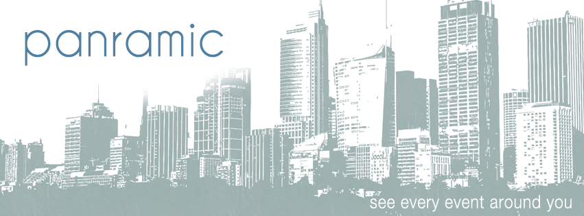
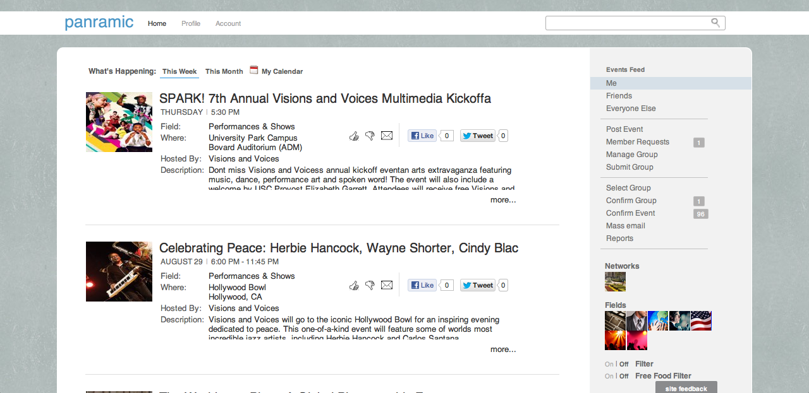
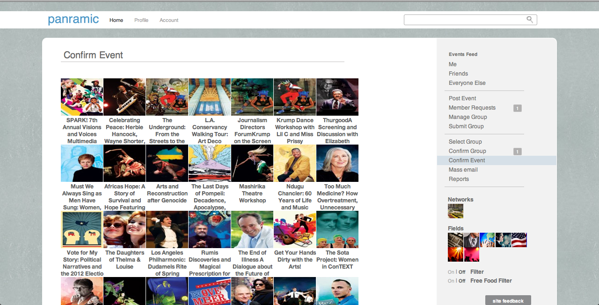

# Panramic 
#### By Bennett Lee

### Background

Developed in the Freshmen year at USC, Panarmic was my first computer science project. As a Business Administration major wiith absolutely no prior experience in computing, I learned 7 different computer languages in two months : HTML, CSS, Javascript, Ajax, PHP, SQL, and Bash. It was a period of insatiable curiosity. What is an ip address? What is a function? What is the OSI model? What are protocols? Why use sessions instead of cookies? I had to understand every single minute detail underneath the hood in computing. Every single variable and contingency has to be mapped out and accounted for.  I completely immerse myself and was captivated by the world of computer science. In this world i saw the opportunity to build, to create, and to invent. 

I spent every ounce of my being  sketching, planning, strategizing, learning, programing, designing, building, and tweaking. The final product was everything I had hoped for. It was my masterpiece and I call it Panramic.

### Description

There are over 800 campus organizations at USC. Each one of these organization have a calendar with hundreds of events. This is an absurd about of information. Organizations have been promoting their events with posters, flyers, newsletters, text messages, facebook invites, catalogues, and pamphlets. Yet it is hard for any one of us to name one to two events on campus.

What if we can give every person a 360 crystal clear view of everything that is going on around them? Our vision is to pull together every event on campus through a single network, generate an events feed, and filter the events based on the person.

Website: http://panramic.com
Video: https://www.youtube.com/watch?v=5ceozhmVzoE

### Potential Societal Impact

The motivation behind Panramic stems from the realization that people are generally unaware of events around them. The irony is that there is so much going on around us that we don't even know where to start. This issue certainly spans beyond the college environment where people may have an even more difficult time knowing about events in their local community.

Panramic provides a revolutionary way to see the world around us. This connection with our environment has never been formed before. Software engineers will know if Google or Intel are holding lectures around them. People interested in community service will know about outreach programs.  Our vision is to redefine the way people can see and connect with the world around them.
